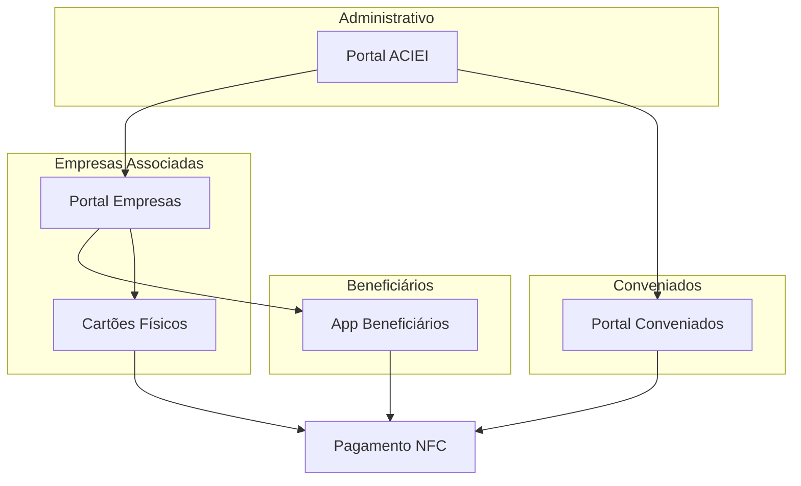

## 1. Visão Geral do Produto

O ACIEIcard é um sistema completo de gestão e pagamentos com tecnologia NFC desenvolvido para a ACIEI (Associação Comercial e Empresarial de Itaquaquecetuba). O sistema permite o gerenciamento de empresas associadas, seus beneficiários e a realização de pagamentos através de cartões físicos e aplicativo móvel com tecnologia NFC.

O produto resolve o problema da gestão financeira e de pagamentos dentro do ecossistema empresarial da associação, proporcionando controle total sobre limites, saldos e transações. Visa modernizar o sistema de pagamentos e beneficios para associados, beneficiários e estabelecimentos conveniados.

## 2. Funcionalidades Principais

### 2.1 Perfis de Usuário

| Perfil | Método de Acesso | Permissões Principais |
|--------|------------------|----------------------|
| ACIEI (Administrador) | Login com email e senha | Gestão completa do sistema, empresas, beneficiários, relatórios |
| Empresa Associada | Login com CNPJ e senha | Cadastrar beneficiários, definir limites, visualizar extratos |
| Beneficiário | App móvel com CPF e senha | Realizar pagamentos, consultar saldo, visualizar extrato |
| Conveniado | Login com CNPJ e senha | Receber pagamentos, visualizar vendas, gerenciar estabelecimento |

### 2.2 Módulos de Funcionalidades

O sistema ACIEIcard consiste nos seguintes módulos principais:

1. **Portal Administrativo ACIEI**: Dashboard administrativo, gestão de empresas, gestão de conveniados, relatórios gerais
2. **Portal Empresas Associadas**: Dashboard empresarial, gestão de beneficiários, definição de limites, extratos e relatórios
3. **Aplicativo Beneficiários**: Carteira digital, pagamento NFC, consulta de saldo, extrato de transações
4. **Portal Conveniados**: Recebimento de pagamentos, dashboard de vendas, gestão do estabelecimento
5. **Sistema de Cartões Físicos**: Emissão, gestão e controle de cartões físicos com chip NFC

### 2.3 Detalhamento das Funcionalidades

| Módulo | Funcionalidade | Descrição |
|--------|---------------|-----------|
| Portal ACIEI | Dashboard Administrativo | Visualizar estatísticas gerais, total de empresas, beneficiários, transações do mês |
| Portal ACIEI | Gestão de Empresas | Cadastrar, editar, ativar/desativar empresas associadas, definir parametros gerais |
| Portal ACIEI | Gestão de Conveniados | Aprovar cadastro de estabelecimentos, gerenciar taxas e condições |
| Portal ACIEI | Relatórios Gerais | Emitir relatórios de transações, faturamento, utilização do sistema |
| Portal Empresas | Dashboard Empresarial | Visualizar resumo da conta, beneficiários ativos, transações recentes |
| Portal Empresas | Cadastro de Beneficiários | Adicionar novos beneficiários com CPF, nome, foto e dados pessoais |
| Portal Empresas | Definição de Limites | Estabelecer limites diários, semanais e mensais para cada beneficiário |
| Portal Empresas | Extrato e Relatórios | Visualizar todas as transações, filtrar por período, beneficiário ou valor |
| App Beneficiários | Carteira Digital | Exibir saldo atual, limite disponível, dados do cartão virtual |
| App Beneficiários | Pagamento NFC | Realizar pagamentos aproximando o celular ou cartão físico da maquininha |
| App Beneficiários | Consulta de Saldo | Verificar saldo disponível e limites em tempo real |
| App Beneficiários | Extrato de Transações | Visualizar histórico completo de compras com detalhes |
| Portal Conveniados | Recebimento de Pagamentos | Processar pagamentos via NFC com confirmação instantânea |
| Portal Conveniados | Dashboard de Vendas | Acompanhar vendas do dia, semana e mês, valores totais |
| Portal Conveniados | Gestão do Estabelecimento | Configurar dados do estabelecimento, horários, formas de pagamento |
| Sistema Cartões | Emissão de Cartões | Gerar cartões físicos com chip NFC e código único |
| Sistema Cartões | Gestão de Cartões | Ativar, bloquear, cancelar cartões físicos |
| Sistema Cartões | Vinculação ao Beneficiário | Associar cartão físico ao beneficiário no sistema |

## 3. Fluxos de Trabalho Principais

### 3.1 Fluxo de Cadastro de Empresa Associada

O administrador ACIEI realiza o cadastro da empresa associada com CNPJ, razão social, endereço e dados bancários. A empresa recebe credenciais de acesso e pode então cadastrar seus beneficiários. O sistema gera um código único para a empresa e estabelece os parametros iniciais de funcionamento.

### 3.2 Fluxo de Cadastro de Beneficiário

A empresa associada acessa o portal e cadastra o beneficiário com CPF, nome completo, foto e dados pessoais. O sistema valida o CPF e cria uma conta digital vinculada à empresa. O beneficiário recebe instruções para baixar o app e ativar sua conta.

### 3.3 Fluxo de Pagamento NFC

O beneficiário aproxima o celular (com app ativo) ou cartão físico da maquininha do conveniado. O sistema valida a autenticidade, verifica o saldo disponível e processa o pagamento em segundos. Ambos recebem confirmação instantânea da transação.

### 3.4 Fluxo de Recarga de Créditos

A empresa associada solicita recarga de créditos através do portal. O administrador ACIEI analisa e aprova a solicitação. O valor é adicionado ao saldo da empresa e distribuído entre os beneficiários conforme limites estabelecidos.

## 4. Design de Interface

### 4.1 Estilo de Design

- **Cores Primárias**: Azul institucional (#1E3A8A) e branco (#FFFFFF)
- **Cores Secundárias**: Verde para sucesso (#10B981), vermelho para alertas (#EF4444)
- **Estilo de Botões**: Arredondados com sombra suave, hover effects suaves
- **Tipografia**: Fonte moderna sans-serif (Inter ou Roboto), títulos em bold 24px, texto corporal 16px
- **Layout**: Baseado em cards com bordas arredondadas, navegação lateral para portais, bottom navigation para app
- **Ícones**: Estilo outline minimalista, consistentes em todo o sistema

### 4.2 Visão Geral das Interfaces

| Módulo | Componente | Elementos de UI |
|--------|------------|----------------|
| Portal ACIEI | Dashboard | Cards com estatísticas em azul e branco, gráficos de barras para transações, tabelas com dados das empresas |
| Portal Empresas | Cadastro Beneficiários | Formulário limpo com campos de entrada, upload de foto drag-and-drop, botões primários em azul |
| App Beneficiários | Carteira Digital | Interface limpa com saldo em destaque, botão de pagamento grande e centralizado, ícones intuitivos |
| Portal Conveniados | Recebimento Pagamento | Interface simples com campo de valor, botão de confirmação verde, feedback visual do status |
| Todos Módulos | Extratos/Relatórios | Tabelas responsivas com zebra striping, filtros laterais, exportação em PDF/Excel |

### 4.3 Responsividade

O sistema é desenvolvido com abordagem mobile-first. O aplicativo dos beneficiários é nativamente móvel. Os portais web são totalmente responsivos, adaptando-se desde smartphones até desktops. Otimizado para touch em dispositivos móveis com botões grandes e áreas de toque adequadas.