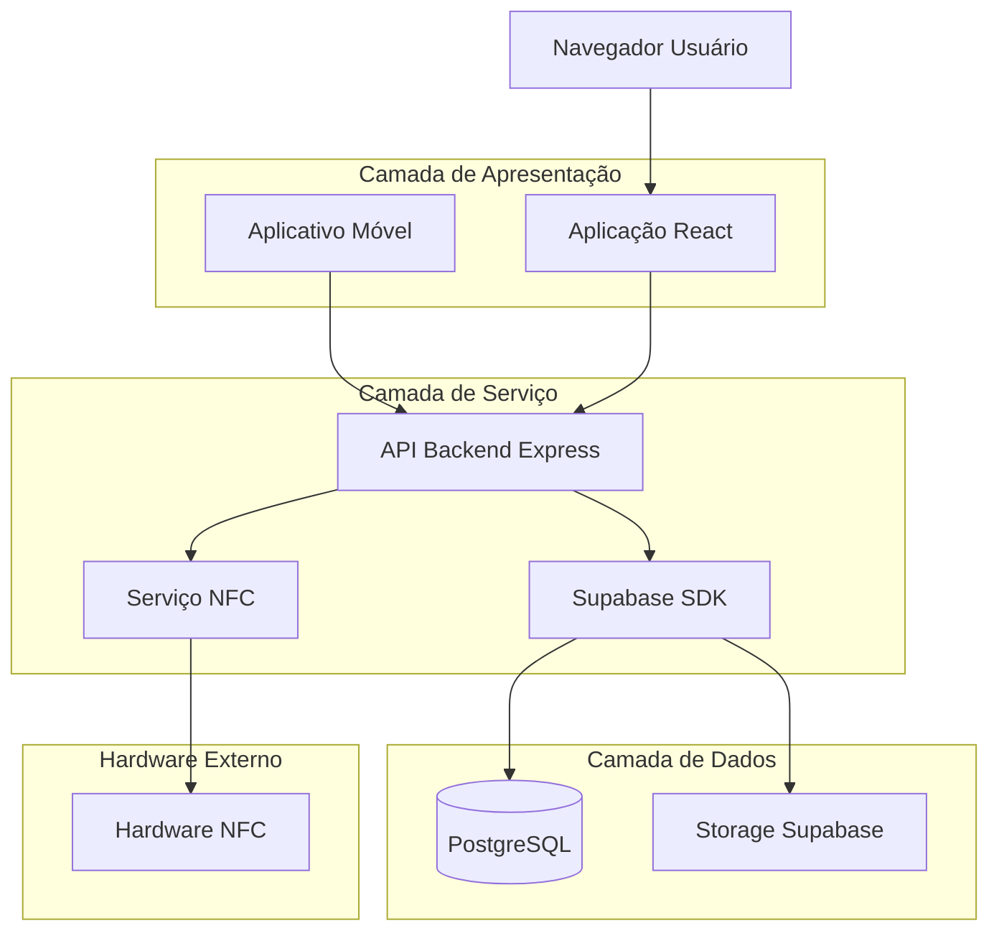
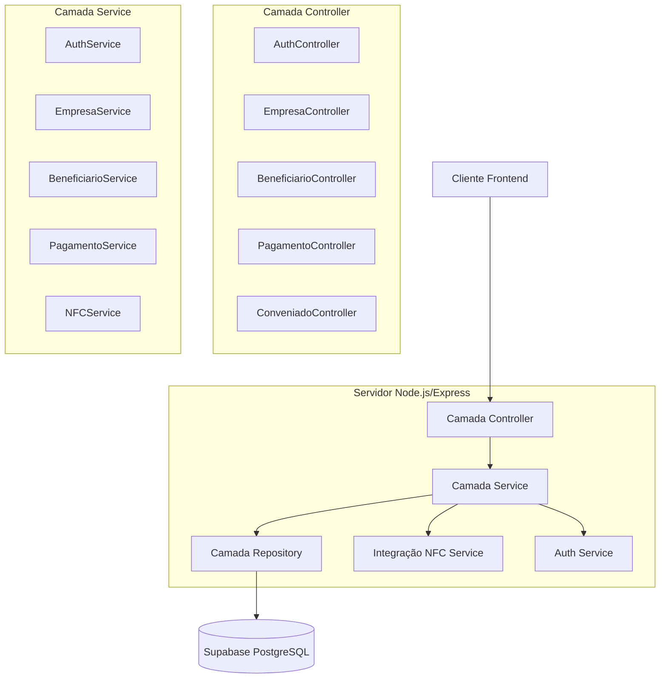
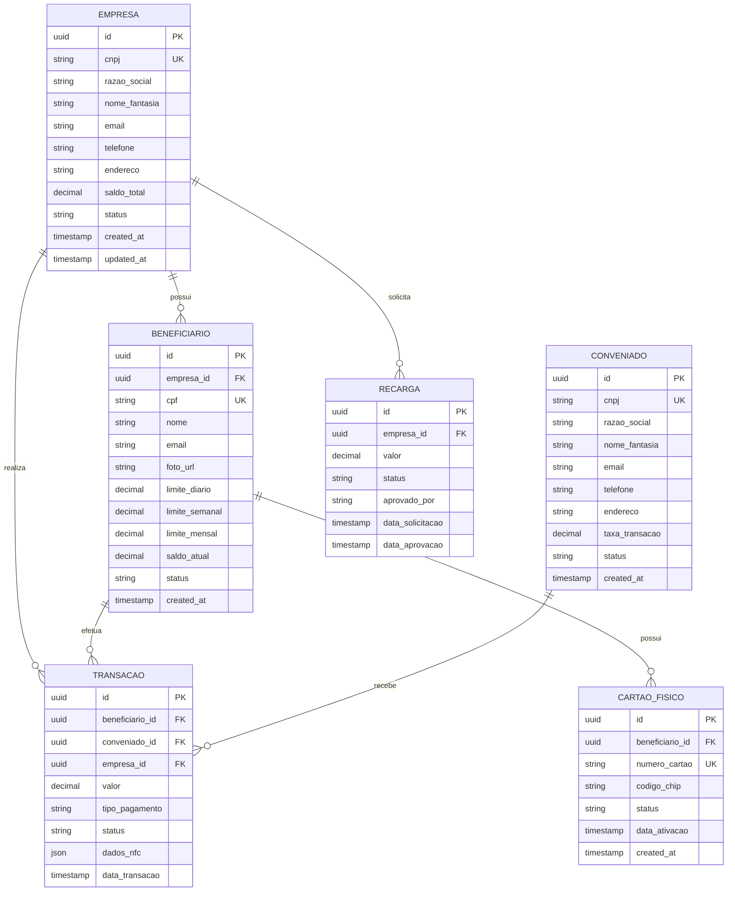

## 1. Arquitetura do Sistema



## 2. Descrição das Tecnologias

- **Frontend**: React@18 + TypeScript + Vite + Tailwind CSS@3
- **Backend**: Node.js@20 + Express@4 + TypeScript
- **Banco de Dados**: Supabase (PostgreSQL@15)
- **Autenticação**: Supabase Auth com JWT
- **Storage**: Supabase Storage para arquivos
- **Aplicativo Móvel**: React Native + Expo
- **Integração NFC**: React Native NFC Manager
- **Deploy**: Vercel (frontend), Railway (backend), Supabase (database)

## 3. Definições de Rotas

### 3.1 Rotas Frontend (React)

| Rota | Finalidade |
|------|------------|
| / | Landing page institucional |
| /admin/login | Login do administrador ACIEI |
| /admin/dashboard | Dashboard administrativo |
| /admin/empresas | Gestão de empresas associadas |
| /admin/conveniados | Gestão de estabelecimentos conveniados |
| /empresa/login | Login para empresas associadas |
| /empresa/dashboard | Dashboard empresarial |
| /empresa/beneficiarios | Cadastro e gestão de beneficiários |
| /empresa/limites | Configuração de limites por beneficiário |
| /empresa/extrato | Extrato e relatórios da empresa |
| /conveniado/login | Login para estabelecimentos conveniados |
| /conveniado/dashboard | Dashboard de vendas |
| /conveniado/receber | Interface para recebimento de pagamentos |
| /conveniado/vendas | Histórico de vendas realizadas |

### 3.2 Rotas API Backend

| Rota | Método | Finalidade |
|------|--------|------------|
| /api/auth/login | POST | Autenticação de usuários |
| /api/auth/logout | POST | Logout do sistema |
| /api/auth/refresh | POST | Renovação de token JWT |
| /api/empresas | GET | Listar empresas associadas |
| /api/empresas | POST | Cadastrar nova empresa |
| /api/empresas/:id | PUT | Atualizar dados da empresa |
| /api/beneficiarios | GET | Listar beneficiários |
| /api/beneficiarios | POST | Cadastrar beneficiário |
| /api/beneficiarios/:id | PUT | Atualizar beneficiário |
| /api/pagamentos | POST | Processar pagamento NFC |
| /api/pagamentos/:id | GET | Consultar pagamento |
| /api/saldo/:beneficiarioId | GET | Consultar saldo disponível |
| /api/extrato/:beneficiarioId | GET | Obter extrato de transações |
| /api/cartoes | POST | Emitir cartão físico |
| /api/cartoes/:id | PUT | Ativar/bloquear cartão |
| /api/conveniados | GET | Listar estabelecimentos |
| /api/conveniados/:id/vendas | GET | Vendas por conveniado |

## 4. Definições de API

### 4.1 API de Autenticação

**POST /api/auth/login**

Request:
```json
{
  "cpf_cnpj": "12345678900",
  "senha": "senha123",
  "tipo_usuario": "empresa"
}
```

Response:
```json
{
  "token": "eyJhbGciOiJIUzI1NiIsInR5cCI6IkpXVCJ9...",
  "usuario": {
    "id": "uuid-123",
    "nome": "Empresa XYZ",
    "tipo": "empresa",
    "perfil": "empresa_associada"
  }
}
```

### 4.2 API de Pagamentos NFC

**POST /api/pagamentos**

Request:
```json
{
  "beneficiario_id": "uuid-456",
  "conveniado_id": "uuid-789",
  "valor": 150.50,
  "tipo_pagamento": "nfc",
  "dados_nfc": {
    "card_id": "card-123",
    "terminal_id": "terminal-456",
    "timestamp": "2024-01-15T10:30:00Z"
  }
}
```

Response:
```json
{
  "transacao_id": "trans-789",
  "status": "aprovado",
  "mensagem": "Pagamento realizado com sucesso",
  "saldo_restante": 849.50,
  "timestamp": "2024-01-15T10:30:15Z"
}
```

### 4.3 API de Beneficiários

**GET /api/beneficiarios/:empresaId**

Response:
```json
{
  "beneficiarios": [
    {
      "id": "uuid-111",
      "nome": "João Silva",
      "cpf": "12345678900",
      "foto_url": "https://storage.supabase.co/foto123.jpg",
      "limite_diario": 200.00,
      "limite_semanal": 1000.00,
      "limite_mensal": 3000.00,
      "saldo_atual": 1500.00,
      "status": "ativo",
      "data_cadastro": "2024-01-01T00:00:00Z"
    }
  ]
}
```

## 5. Arquitetura do Servidor



## 6. Modelo de Dados

### 6.1 Diagrama Entidade-Relacionamento



### 6.2 Definições DDL

**Tabela Empresas:**
```sql
CREATE TABLE empresas (
    id UUID PRIMARY KEY DEFAULT gen_random_uuid(),
    cnpj VARCHAR(14) UNIQUE NOT NULL,
    razao_social VARCHAR(255) NOT NULL,
    nome_fantasia VARCHAR(255),
    email VARCHAR(255) UNIQUE NOT NULL,
    telefone VARCHAR(20),
    endereco TEXT,
    saldo_total DECIMAL(10,2) DEFAULT 0.00,
    status VARCHAR(20) DEFAULT 'ativo' CHECK (status IN ('ativo', 'inativo', 'suspenso')),
    password_hash VARCHAR(255) NOT NULL,
    created_at TIMESTAMP WITH TIME ZONE DEFAULT NOW(),
    updated_at TIMESTAMP WITH TIME ZONE DEFAULT NOW()
);

-- Índices para performance
CREATE INDEX idx_empresas_cnpj ON empresas(cnpj);
CREATE INDEX idx_empresas_status ON empresas(status);
```

**Tabela Beneficiarios:**
```sql
CREATE TABLE beneficiarios (
    id UUID PRIMARY KEY DEFAULT gen_random_uuid(),
    empresa_id UUID NOT NULL REFERENCES empresas(id),
    cpf VARCHAR(11) UNIQUE NOT NULL,
    nome VARCHAR(255) NOT NULL,
    email VARCHAR(255),
    foto_url TEXT,
    limite_diario DECIMAL(10,2) DEFAULT 200.00,
    limite_semanal DECIMAL(10,2) DEFAULT 1000.00,
    limite_mensal DECIMAL(10,2) DEFAULT 3000.00,
    saldo_atual DECIMAL(10,2) DEFAULT 0.00,
    status VARCHAR(20) DEFAULT 'ativo' CHECK (status IN ('ativo', 'inativo')),
    password_hash VARCHAR(255),
    created_at TIMESTAMP WITH TIME ZONE DEFAULT NOW(),
    updated_at TIMESTAMP WITH TIME ZONE DEFAULT NOW()
);

CREATE INDEX idx_beneficiarios_empresa ON beneficiarios(empresa_id);
CREATE INDEX idx_beneficiarios_cpf ON beneficiarios(cpf);
```

**Tabela Transacoes:**
```sql
CREATE TABLE transacoes (
    id UUID PRIMARY KEY DEFAULT gen_random_uuid(),
    beneficiario_id UUID NOT NULL REFERENCES beneficiarios(id),
    conveniado_id UUID NOT NULL REFERENCES conveniados(id),
    empresa_id UUID NOT NULL REFERENCES empresas(id),
    valor DECIMAL(10,2) NOT NULL,
    tipo_pagamento VARCHAR(20) NOT NULL CHECK (tipo_pagamento IN ('nfc', 'qr_code', 'manual')),
    status VARCHAR(20) NOT NULL CHECK (status IN ('aprovado', 'recusado', 'pendente', 'cancelado')),
    dados_nfc JSONB,
    data_transacao TIMESTAMP WITH TIME ZONE DEFAULT NOW()
);

CREATE INDEX idx_transacoes_beneficiario ON transacoes(beneficiario_id);
CREATE INDEX idx_transacoes_conveniado ON transacoes(conveniado_id);
CREATE INDEX idx_transacoes_data ON transacoes(data_transacao);
```

### 6.3 Permissões Supabase

```sql
-- Conceder permissões básicas para usuários anônimos
GRANT SELECT ON empresas TO anon;
GRANT SELECT ON conveniados TO anon;

-- Conceder permissões completas para usuários autenticados
GRANT ALL PRIVILEGES ON empresas TO authenticated;
GRANT ALL PRIVILEGES ON beneficiarios TO authenticated;
GRANT ALL PRIVILEGES ON transacoes TO authenticated;
GRANT ALL PRIVILEGES ON cartoes_fisicos TO authenticated;
GRANT ALL PRIVILEGES ON recargas TO authenticated;
```

## 7. Segurança e Performance

### 7.1 Segurança
- Autenticação JWT com tokens de 24 horas
- Criptografia de senhas com bcrypt (salt rounds: 12)
- Rate limiting: 100 requisições por minuto por IP
- CORS configurado para domínios específicos
- Validação de entrada com Joi/Yup
- Logs de auditoria para todas as transações

### 7.2 Performance
- Cache Redis para consultas frequentes (saldo, limites)
- Índices otimizados em campos de busca
- Paginação em listagens (máx. 50 itens por página)
- Compressão gzip nas respostas da API
- CDN para assets estáticos e imagens

### 7.3 Escalabilidade
- Arquitetura stateless para horizontal scaling
- Load balancer para distribuição de carga
- Supabase com auto-scaling de leitura
- Filas para processamento assíncrono (Bull/Redis)